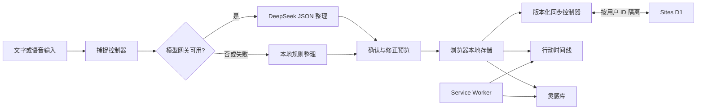

# 念行系统架构

## 架构结论

系统采用“本地先写、D1 持久化、平台身份隔离、模型只给建议”的边界。记录在断网时立即可用，联网后按登录用户同步；浏览器不持有 API Key，模型输出也不能直接改写用户数据。



## 分层与职责

| 层 | 职责 | 关键边界 |
| --- | --- | --- |
| 移动端界面 | 时间线、灵感库、捕捉、编辑、安装提示 | 不持有模型密钥 |
| 领域层 | 条目类型、时间解析、状态迁移、数据校验 | 不依赖 UI 与模型供应商 |
| 本地数据层 | 立即保存任务、灵感、删除墓碑与首选项 | 断网仍可写入 |
| 同步层 | 初始化迁移、revision 检查、冲突合并与重试 | 不从浏览器接收用户 ID |
| D1 数据层 | 保存每个登录用户的持久状态与 AI 限流计数 | 服务端按平台用户 ID 分区 |
| 整理服务 | 选择远程 AI 或本地解析，统一返回契约 | 失败必须降级 |
| 模型网关 | 鉴权、限流、提示词、JSON 校验 | 不直接写用户数据 |
| PWA 外壳 | Manifest、图标、离线缓存 | API 响应不进入缓存 |

## 核心数据

```ts
type Task = {
  id: string;
  title: string;
  scheduledAt: string | null; // null = 待安排
  durationMinutes?: number;
  status: "open" | "done";
  notes?: string;
  tags: string[];
  source: "seed" | "local" | "deepseek" | "manual";
  createdAt: string;
  updatedAt: string;
};

type Idea = {
  id: string;
  title: string;
  kind: "idea" | "learning";
  notes?: string;
  tags: string[];
  status: "inbox" | "exploring" | "archived";
  source: "seed" | "local" | "deepseek" | "manual";
  createdAt: string;
  updatedAt: string;
};
```

应用数据使用 `schemaVersion: 2`，并保存任务与灵感删除墓碑。云端 `user_states` 表以平台用户 ID 为主键，状态文档带单调递增 revision；`ai_rate_limits` 表按用户和分钟窗口限制模型请求。

## 同步契约

- `GET /api/state`：返回当前登录用户的状态、revision、同步时间和 AI 配置状态。
- `PUT /api/state`：提交完整状态与 `baseRevision`。revision 不匹配时返回 `409` 和最新云端状态。
- 客户端按 `updatedAt` 合并同一条目，删除墓碑在时间相同或更新时优先。
- 首次打开已有云数据时，空白示例库不会覆盖云端；已有真实本地记录会合并并上传。

## AI 请求契约

`POST /api/organize`

```json
{
  "text": "明天下午提醒我研究 PWA 的离线能力，顺便保存几个教程",
  "now": "2026-08-13T15:00:00.000Z",
  "timezone": "Asia/Singapore",
  "locale": "zh-CN"
}
```

```json
{
  "source": "deepseek",
  "model": "deepseek-v4-flash",
  "items": [
    {
      "kind": "task",
      "title": "研究 PWA 的离线能力",
      "scheduledAt": "2026-08-14T14:00:00+08:00",
      "durationMinutes": 45,
      "notes": null,
      "tags": ["PWA"]
    }
  ]
}
```

服务端必须校验正文长度、条目数量、枚举、时间和字符串长度。浏览器收到响应后再次校验；任一环节失败都转到本地解析。

## 安全与隐私

- `DEEPSEEK_API_KEY` 只存在于 Sites 服务端秘密变量。
- `/api/state` 与 `/api/organize` 都要求平台注入的登录用户 ID；服务端不接受客户端自报身份。
- 网关限制请求体、超时、同源访问与单用户请求频率。
- 模型仅接收用户本次主动提交的文本、当前时间与时区，不上传本地历史库。
- 模型输出视为不可信建议，需经过结构校验与用户确认。
- Service Worker 不缓存 `/api/`、密钥、模型响应或错误详情。

## 失败策略

| 失败 | 用户结果 |
| --- | --- |
| 未配置模型 | 立即使用本地整理 |
| 网络断开或超时 | 保留原始输入，使用本地整理 |
| JSON 不合法或空响应 | 丢弃远程结果，使用本地整理 |
| 本地存储不可用 | 当前会话继续工作并提示无法持久保存 |
| 云端暂时不可用或 revision 冲突 | 保留本地修改；恢复后合并并重试 |
| 身份缺失 | 拒绝 API 请求，不读取或写入任何用户数据 |
| 语音能力不可用 | 保留文字入口并给出明确提示 |

## 目录边界

- `src/Prototype.tsx` 与 `src/prototype.css`：产品界面与交互。
- `src/domain/`：类型、日期和本地解析。
- `src/data/`：本地数据仓储。
- `src/services/`：同步、冲突合并、整理服务与远程端点适配。
- `worker/`：Sites D1 同步 API 与 DeepSeek 安全网关。
- `db/` 与 `drizzle/`：D1 模式定义与可追溯迁移。
- `server/`：仅供本地开发的 DeepSeek 安全代理。
- `public/`：Manifest、Service Worker 与安装图标。
- `docs/`：需求、架构、决策与视觉真源。
